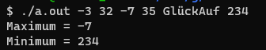

# Übung 02 - Lösung

**Name: Daniel Mitterlehner**

## 1. Aufgabe 1 (src/minmax/)

### Lösungsidee
#### Kommandozeilen Parameter erhält man in C über den Parameter argv der main-Funktion. Da diese Parameter als Zeichenkette daher kommen muss man sie wahrscheinlich in eine Zahl umwandeln zB. mit Type-Cast. Min, Max als globale Variable speichern und mit 0 initialisieren. Wenn etwas größer oder kleiner ist entsprechend Min oder Max aktualisieren und ausgeben.
### Implementierung
### Tests

1. Compilieren und keine Parameter

2. Nur positive Werte

3. Nur negative Werte

4. Minimum an 1. Stelle

5. Minimum an letzter Stelle

6. Negative und positive Werte

7. Zeichenketter übergeben statt Zahl

## 2. Aufgabe 2 (src/yyy/)  

### Lösungsidee
### Implementierung
### Tests
